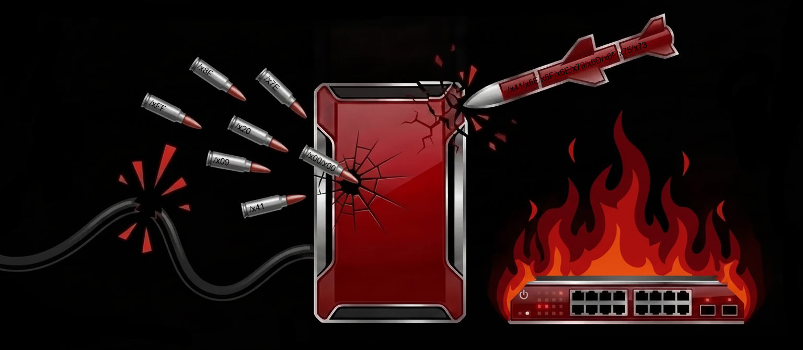

<p align="center">
  
</p>

# NetDestruct

Network reconnaissance and attack toolkit.

NetDestruct covers Layer-2/3 protocol abuse, service enumeration, offline hash cracking, MitM, and DoS. Most L2 modules need Linux with root (or `CAP_NET_RAW`). Many TCP/UDP service modules work without root.

---

## Build

```bash
go build -o NetDestruct .
```

Requires **Go 1.25+**. Standard library only (no third-party modules).

```bash
./NetDestruct -h
```

---

## Capabilities

| Area | What it does | Docs |
|------|----------------|------|
| **Intelligence Gathering** | ARP scan, CDP/DTP/DHCP/802.1Q/802.1X enum, SMB version, Memcached recon | [Intelligence Gathering](Documentation/Intelligence%20Gathering/README.md) |
| **Enumeration** | FTP/TFTP/SSH/Telnet/SMB/SNMP/Memcached enum & brute | [Enumeration](Documentation/Enumeration/README.md) |
| **Man-in-the-Middle** | ARP/DNS/DHCP/ICMP, LLMNR/NBT-NS/mDNS, STP/HSRP/VRRP hijack, SMB relay, cred sniff | [Man-in-the-middle](Documentation/Man-in-the-middle/README.md) |
| **Denial of Service** | MAC/CDP/STP/DHCP/VTP floods, ICMP/TCP/UDP/HTTP floods, EIGRP/OSPF injection | [Denial of Service](Documentation/Denial%20of%20Service/README.md) |
| **VLAN Bypassing** | CDP inject, DTP enable-trunk, 802.1Q double-tag | [Vlan Bypassing](Documentation/Vlan%20Bypassing/README.md) |
| **VLAN Tampering** | VTP add VLAN | [Vlan Tampering](Documentation/Vlan%20Tampering/README.md) |
| **Authentication Cracking** | Offline extract/crack from pcap: OSPF, HSRP, EIGRP, VRRP, GLBP, NTP, BFD, VTP, RSVP, IS-IS, TACACS+, SSH keys | [Authentication Cracking](Documentation/Authentication%20Cracking/README.md) |
| **Cisco Passwords** | Offline Type 4/5/7/8/9 crack/decrypt | [Cisco Passwords](Documentation/Cisco%20Passwords/README.md) |
| **Data Manipulation** | SNMP SET, Memcached set/delete | [Data Manipulation](Documentation/Data%20Manipulation/README.md) |
| **Exfiltration** | SNMPv3 Cisco running-config → TFTP | [Exfiltration](Documentation/Exfiltration/README.md) |

Full flag lists, behavior, colors, and examples live under `Documentation/`.

---

## Quick examples

```bash
# L2 intel
sudo ./NetDestruct --cdp --enum -I eth0
sudo ./NetDestruct --arp-scan --active -I eth0 --range 192.168.1.0/24

# Service enum / brute
./NetDestruct --ssh --auth-methods --target 192.168.1.10 --username cisco
./NetDestruct --telnet --brute --target 192.168.1.10 --userlist users.txt --passlist pass.txt
./NetDestruct --snmp --enum --v2c --community public --target 192.168.1.10

# MitM
sudo ./NetDestruct --arp --poison -I eth0 --ip 192.168.1.50
sudo ./NetDestruct --dns --hijack -I eth0 --target 192.168.1.50
sudo ./NetDestruct --llmnr --nbt-ns -I eth0

# Offline auth cracking
./NetDestruct --ospf --capture ospf.pcap --crack --wordlist rockyou.txt
./NetDestruct --cisco-pass --type7 --hash 0822455D0A16

# DoS
sudo ./NetDestruct --mac-flood -I eth0 --flood-rate 1000
```

---

## Layout

```
NetDestruct/
├── main.go                 # CLI (Cobra) wiring
├── libs/
│   ├── authentication-cracking/
│   ├── cisco-passwords/
│   ├── data-manipulation/
│   ├── dos/
│   ├── enumeration/
│   ├── exfiltration/
│   ├── intelligence-gathering/
│   ├── mitm/
│   ├── vlan-bypassing/
│   └── vlan-tampering/
└── Documentation/          # Per-module READMEs
```

---

## Requirements

| Mode | Typical needs |
|------|----------------|
| Raw L2 / MitM / floods | Linux, root or `CAP_NET_RAW`, interface (`-I`) |
| TCP/UDP service enum/brute | Network reachability; often no root |
| Offline cracking | Capture/key/config file; no root |
